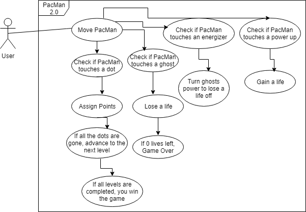

# IndividualProjectProposal
  Pac-Man 2.0

## Project Abstract

  Lots of people, including myself, spent a lot of their childhood playing video games. One of the most iconic arcade games of all time, is Pac-Man. Pac-Man is an arcade game which requires the user to play as Pac-Man and advance from level to level without dying. The only way to die in Pac-Man is to run into one of the four ghosts. There are four ghosts named Blinky, Pinky, Inky, and Clyde. Once you eat all of the "dots" on the screen, you advance a level. Each dot gives you more points as you try to advance on the scoreboard. There are also power ups and energizers. In the game there are several energizers that let PacMan eat the ghosts for a short time frame and gain points for doing so. Ultimately, PacMan is an arcade game where people compete to see who can get the highest score.
  
  
  
  
## Project Relevance  
  
  This proposal is linked to the educational goals of this class. This project will continue to expand my knowledge on how to use Github. It will teach me how to collaborate and improve on someone else's project. The project will help me solve issues, test code, and use good time management. This project will also be the first game I created or modified with Java. It will improve our graphic design and design pattern skills.
  
## Conceptual Design  
  
  I found an open source project of the classic game of Pac-Man. Currently this game has one level and does not have chase mode. Chase mode is when Pac-Man eats an energizer and can eat the ghosts for a temporary time like he eats the dots. I want to create a unique version of Pac-Man while still including its most basic elements. I want to create new levels with challenging new mazes. I want to add new power ups and new enemies who will try to kill Pac-Man. Pac-Man 2.0 takes the current elements of Pac-Man and reimagines them in a new way.
  
  
## Background 

  https://github.com/dtschust/javapacman 
  
  
## Required Resources  
  IntelliJ/NetBeans
  Github
